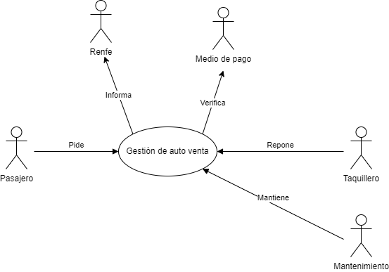
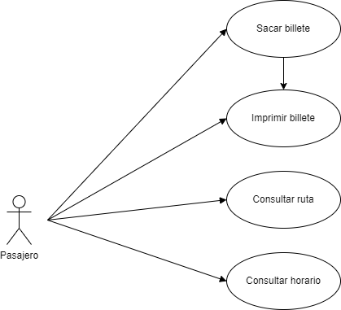
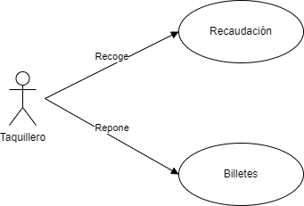
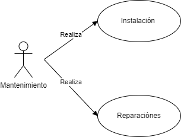

# Nombres Usuarios Git

- Adria A = wade079
- Carlos J  = Joheartless 
- Albert J = Necromancer117 

## Proyecto: Maquina vendedora de billetes de tren

### Descripcion:

 La plataforma brinda una experiencia interactiva e intuitiva que posibilita a los usuarios elegir entre diversos idiomas (inglés, francés, alemán, catalán y castellano) , explorar, seleccionar y reservar sus trayectos de tren con facilidad. Al proporcionar opciones detalladas de horarios y rutas, nuestros usuarios pueden personalizar su viaje según sus necesidades específicas.

Priorizamos la seguridad y la comodidad en cada transacción, por lo que hemos implementado un sistema de pago diversificado que acepta múltiples formas de pago electrónico, excluyendo el uso de efectivo. Esta medida no solo optimiza la seguridad al reducir el riesgo asociado, sino que también agiliza el proceso de compra para una experiencia de usuario más fluida.

Con miras al futuro, estamos comprometidos con la expansión de nuestra plataforma para incluir una aplicación móvil. Esta evolución permitirá un acceso aún más conveniente y adaptable, asegurando que nuestros usuarios puedan gestionar sus reservas y viajes en tren con solo unos pocos clics desde cualquier lugar y en cualquier momento.

#### Las características principales de la plataforma:

 - Multilingüe: Ofrece soporte para varios idiomas, incluidos inglés, francés, alemán, catalán y castellano, facilitando a usuarios de diversas regiones la navegación y el uso de la plataforma.

 - Interfaz Intuitiva: La experiencia de usuario está diseñada para ser interactiva e intuitiva, permitiendo explorar, seleccionar y reservar trayectos de tren con facilidad.

 - Personalización del Viaje: Proporciona opciones detalladas de horarios y rutas, permitiendo a los usuarios personalizar su viaje según sus necesidades específicas.

 - Seguridad y Comodidad en Pagos: Implementa un sistema de pago diversificado que acepta múltiples formas de pago electrónico, excluyendo el efectivo, para optimizar la seguridad y agilizar el proceso de compra.

 - Acceso Móvil en el Futuro: Se planifica la expansión de la plataforma para incluir una aplicación móvil, lo que ofrecerá un acceso aún más conveniente y adaptable para gestionar reservas y viajes en tren desde cualquier lugar y en cualquier momento.

 #### BasicoMaquinaBilletes

 #### BasicoMaquinaBilletes

#### Taquillero casdo de uso

 

 #### Mantenimiento

 #### Renfe casos de uso
 

##### Autors

Los autores de este proyecto son los siguientes:

- [@Adria A](https://github.com/wade079)
- [@Albert J](https://github.com/Necromancer117)
- [@Carlos J](https://github.com/Joheartless)